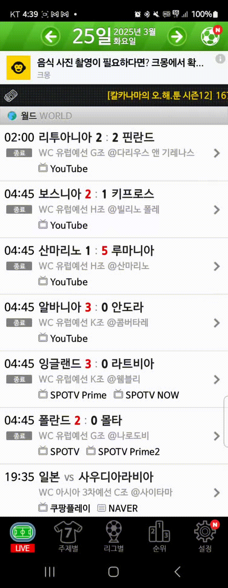
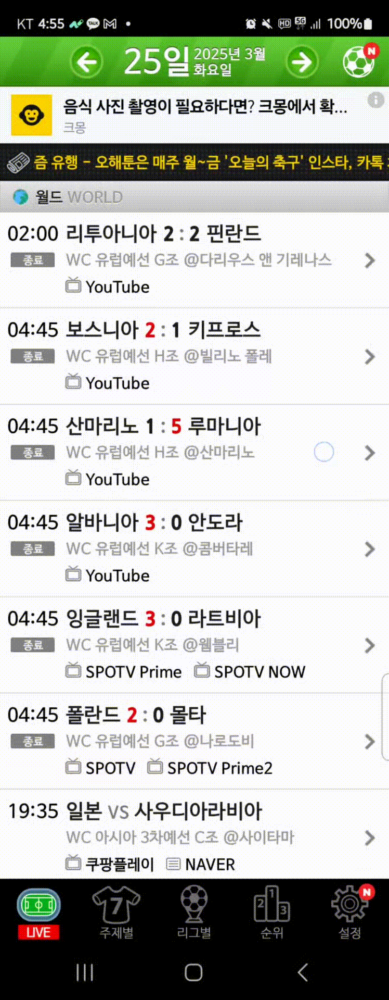

# 스와이프시 클릭되는 문제 해결

<div align="left"><figure><figcaption></figcaption></figure></div>

### 문제 원인

* 사용자가 화면을 터치하면 처음엔 클릭으로 인식되는데, 스와이프가 되더라도 클릭 이벤트는 취소 되지 않음.

#### 기존의 dispatchTouchEvent 구현 방식

```java
public void onDispatchTouchEvent(MotionEvent event) {
    switch (event.getActionMasked()) {
        case MotionEvent.ACTION_DOWN:
            startX = event.getX();
            startY = event.getY();
            isSwipeMode = false;
            break;

        case MotionEvent.ACTION_MOVE:
            float dx = event.getX() - startX;
            float dy = event.getY() - startY;
            if (Math.abs(dx) > 300f && Math.abs(dx) > Math.abs(dy)) {
                // 스와이프 진입
                isSwipeMode = true;
            }
            break;

        case MotionEvent.ACTION_UP:
        case MotionEvent.ACTION_CANCEL:
            resetSwipeState();
            resetArrows();
            break;
    }
    gestureDetector.onTouchEvent(event);
}
```


```java
@Override
public boolean dispatchTouchEvent(MotionEvent ev) {
    swipeHelper.onDispatchTouchEvent(ev)
    return super.dispatchTouchEvent(ev);
}
```


**super.dispatchTouchEvent(ev)** 로 가면서 click 이벤트가 실행되기 때문에 이런 문제가 발생했다.

그래서 swipeHelper의 함수 반환값을 boolean으로 하고 스와이프 이벤트의 경우 **super.dispatchTouchEvent(ev)를** 호출하지 않는 방향으로 구현하였다.


<div align="left"><figure><figcaption></figcaption></figure></div>

하지만 클릭했을 때 남았던 잔상이 사라지지 않는 문제가 발생했다.

```java
@Override
public boolean dispatchTouchEvent(MotionEvent ev) {
    if (swipeHelper.onDispatchTouchEvent(ev)) {
        // ACTION_CANCEL 이벤트를 만들어 하위 뷰에 전달
        MotionEvent cancelEvent = MotionEvent.obtain(ev);
        cancelEvent.setAction(MotionEvent.ACTION_CANCEL);
        super.dispatchTouchEvent(cancelEvent);
        cancelEvent.recycle();
        return true;
    }
    return super.dispatchTouchEvent(ev);
}
```

`MotionEvent.obtain(ev)`로 기존 이벤트를 복사하고 액션만 ACTION\_CANCEL로 변경해서 super로 전달하여 클릭이 일어났다면 취소하도록 동작시켰다.

#### 결과

이 방법을 적용한 후,

* 스와이프를 할 때 클릭 이벤트가 중복되지 않음.
* 스와이프를 시도하다 중간에 손을 떼도 클릭하려고 했던 뷰의 pressed 상태가 깨끗하게 해제됨.


