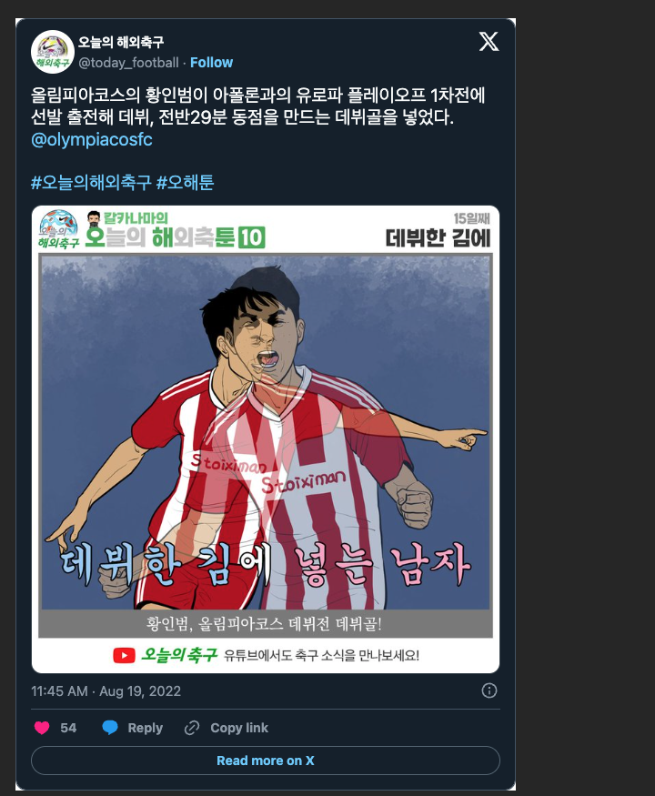

# SSE Client 400 에러

```kotlin
val ktorSSEClient = HttpClient(CIO) {
        install(HttpTimeout) {
            requestTimeoutMillis = Long.MAX_VALUE // SSE는 timeout을 설정하지 않음
        }
        install(SSE) {
            showCommentEvents()
            showRetryEvents()
        }
        install(ContentNegotiation) {
            json(Json {
                prettyPrint = true
                isLenient = true
                ignoreUnknownKeys = true
                allowStructuredMapKeys = true
                // The "classDiscriminator" is specific to kotlinx.serialization; ensure compatibility.
                classDiscriminator = "contentType"
            })
        }
        install(Logging) {
            level = LogLevel.ALL
        }
    }
```

위와 같은 방법으로 ktor에 SSE를 사용할 수 있도록 설정하고,


```kotlin
ktorSSEClient.sse(host = SSE_BASE_URL, path = "/api/v1/chat/stream/$roomId",port = 443) {

    incoming.collect { event ->
        println(event)
        event.data?.let { Json.decodeFromString(ChatMessage.serializer(), it) }?.let {
            emit(it)
        }
    }
}
```

이렇게 메시지를 받아오는 코드를 작성하였다.\
\


## 발생한 문제

로컬 서버를 켜고 로컬 ip로 이벤트를 받아오는 것에는 전혀 문제가 없었다.

하지만, 이를 서버에 올렸더니

<figure><figcaption></figcaption></figure>

이런 오류를 뱉는다...


#### 현재까지는 로드 밸런서에서 거부하는 것으로 파악하고 있다.

하지만, 이상한 점은 \
.png>)

포스트맨이나 curl명령으로 요청을 보낼 때는 이상이 없다는 것이다.


